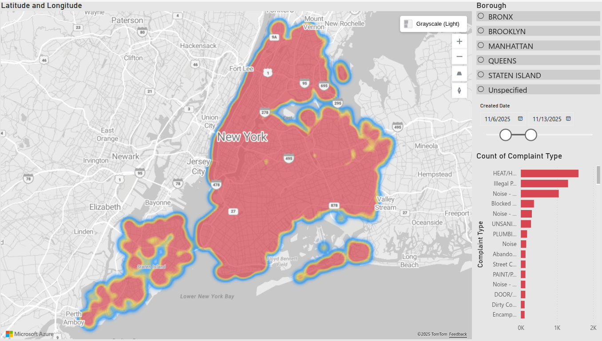
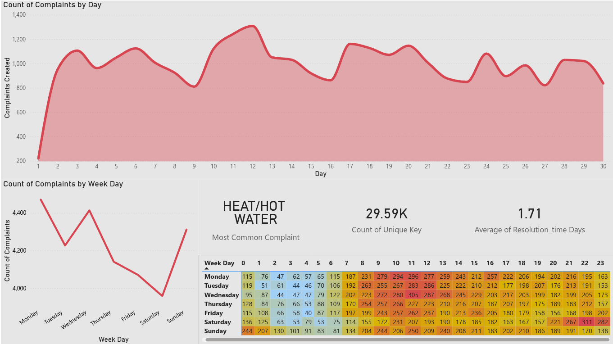

# CityScope – NYC 311 Analysis & Dashboard

CityScope is a data exploration project analyzing NYC 311 service requests to uncover trends in complaint types, temporal activity patterns, and resolution behavior. The project includes a full Python EDA workflow and a Power BI dashboard for interactive insights.

---

## Project Overview

This project transforms 295k+ NYC 311 records into clear, actionable insights.  
Using Python for cleaning and exploration, and Power BI for visualization, the analysis focuses on:

- When complaints are created vs. closed (hourly & weekday patterns)
- Which complaints dominate city service volume
- How long different complaint types take to resolve
- Borough-level differences in complaints
- Backlog behavior (created minus closed)
- Resolution time distribution and service performance

---

## Languages & Libraries**
- Python  
    - pandas  
    - matplotlib  
    - seaborn  
- Power BI Desktop

**Dataset**
- NYC Open Data – *311 Service Requests*

---

##  Dashboard Preview

> **Page 1 — Overview & Key Metrics**  

> **Page 2 — Temporal Heatmaps**
  

---

##  License
This project is released under the MIT License.

---